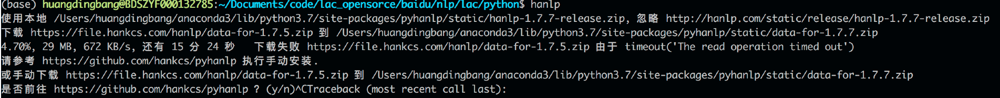

# 分词、词性标注、实体识别工具安装与使用

## 1. LAC

https://github.com/baidu/lac

1. 安装Python版本：pip install lac
2. 调用方式

```python
# 分词
from LAC import LAC
lac = LAC(mode='seg')
seg_results = lac.run("百度是一家高科技公司")
print(' '.join(seg_results))

# 词性标注与实体识别
lac = LAC(mode='lac')
words, tags = lac.run('百度是一家高科技公司') 
print(' '.join('%s/%s' % (word, tag) for (word, tag) in zip(words, tags)) 
```

- 标注含义：https://github.com/baidu/lac

## 2. Jieba

https://github.com/fxsjy/jieba

1. 安装Python版本：pip install jieba
2. 调用方式

```python
# 分词
import jieba
seg_results = jieba.cut("百度是一家高科技公司")
print(' '.join(seg_results))

# 词性标注
import jieba.posseg as posseg
tag_results = posseg.cut('百度是一家高科技公司') 
print(' '.join('%s/%s' % (word, tag) for (word, tag) in tag_results)) 
```

- 标注含义：https://www.cnblogs.com/adienhsuan/p/5674033.html

## 3. THULAC:

https://github.com/thunlp/THULAC-Python

1. 安装Python版本：pip install thulac

2. 调用方式

   ```python
   import thulac
   
   # 分词
   segger = thulac.thulac(seg_only=True)
   seg_results = segger.cut("百度是一家高科技公司")
   print(' '.join(word for word,_ in seg_results))
   
   # 词性标注
   tagger = thulac.thulac()
   tag_results = tagger.cut("百度是一家高科技公司")
   print(' '.join('%s/%s' % (word, tag) for (word, tag) in tag_results)) 
   ```

- 标注含义：

  ```t
  n/名词 np/人名 ns/地名 ni/机构名 nz/其它专名
  m/数词 q/量词 mq/数量词 t/时间词 f/方位词 s/处所词
  v/动词 a/形容词 d/副词 h/前接成分 k/后接成分 
  i/习语 j/简称 r/代词 c/连词 p/介词 u/助词 y/语气助词
  e/叹词 o/拟声词 g/语素 w/标点 x/其它 
  ```


## 4.pkuseg:

https://github.com/lancopku/pkuseg-python

1. 安装Python版本：pip install pkuseg

2. 调用方式

   ```python
   import pkusg
   
   # 分词
   segger = pkuseg.pkuseg()
   seg_results = segger.cut("百度是一家高科技公司")
   print(' '.join(seg_results))
   
   # 词性标注
   tagger = pkuseg.pkuseg(postag=True)
   tag_results = tagger.cut("百度是一家高科技公司")
   print(' '.join('%s/%s' % (word, tag) for (word, tag) in tag_results)) 
   ```

- 标注含义：人民日报语料标注

## 5. pyhanlp

https://github.com/tsroten/pynlpir

1. 安装Python版本：pip install pyhanlp && hanlp

   - 安装可能会下载数据失败，可以通过其他工具下载

   - 运行hanlp会提示下载文件的路径及存放路径：

     

   - 拷贝完成后再次运行hanlp命令可完成解压安装过程：

1. 调用方式

   ```python
   from pyhanlp import HanLP 
   
   han_res = HanLP.segment('百度是一家高科技公司') 
   
   # 分词
   print(' '.join(str(term.word) for term in han_res))
   
   # 词性标注
   print(' '.join('%s/%s' % (str(term.word), str(term.nature)) for term in han_res)) 
   ```

- 标签含义：https://www.cnblogs.com/adienhsuan/p/5674033.html

## 6. StandfordNLP

https://github.com/stanfordnlp/CoreNLP

1. 下载安装[JDK 1.8](http://www.oracle.com/technetwork/java/javase/downloads/jdk8-downloads-2133151.html)及以上版本。

- 安装Python调用脚本：pip install stanfordcorenlp
- 下载字典文件：[斯坦福官网](https://nlp.stanford.edu/software/corenlp-backup-download.html)或[GitHub](https://github.com/stanfordnlp/CoreNLP)均可下载：
  - [stanford-corenlp-full-time.zip](http://nlp.stanford.edu/software/stanford-corenlp-full-2018-02-27.zip)
  - [stanford-chinese-corenlp-time-models.jar](http://nlp.stanford.edu/software/stanford-chinese-corenlp-2018-02-27-models.jar)
- 将stanford-chinese-corenlp-time-models.jar直接放入stanford-corenlp-full-time.zip解压后的文件夹

- 调用方式

  ```python
  from stanfordcorenlp import StanfordCoreNLP 
  stanford_nlp = StanfordCoreNLP('./data/corenlp/stanford-corenlp-full-2018-02-27', lang='zh') 
  
  # 分词 
  seg_results = stanford_nlp.word_tokenize('百度是一家高科技公司')  
  print(' '.join(seg_results)) 
  
  # 词性标注 
  tag_result = stanford_nlp.pos_tag('百度是一家高科技公司') 
  
  # 实体识别 
  tag_results = stanford_nlp.ner('百度是一家高科技公司')
  
  # 打印输出 
  print(' '.join('%s/%s' % (word, tag) for (word, tag) in tag_results)) 
  ```

- 标注含义：https://www.cnblogs.com/tonglin0325/p/6850901.html

## 7. LTP

https://github.com/HIT-SCIR/pyltp

- 安装Python调用脚本：pip install pyltp
- 下载字典文件：http://ltp.ai/download.html：

- Linux和Mac选择第一个模型，Windows根据系统选择
- 下载后解压，通过代码装载文件

- 调用方式

  ```python
  # 分词
  from pyltp import Segmentor  
  ltp_seg = Segmentor()    
  ltp_seg.load('./ltp_data_v3.4.0/cws.model')
  seg_results = ltp_seg.segment('百度是一家高科技公司')
  print(' '.join(seg_results))
  
  
  # 词性标注, 需要分词结果
  from pyltp import Postagger
  ltp_pos = Postagger()
  ltp_pos.load('./ltp_data_v3.4.0/pos.model')
  tag_results = ltp_pos.postag(seg_results)
  print(' '.join('%s/%s' % (word, tag) for (word, tag) in zip(seg_results, tag_results))) 
  
  # 实体识别，需要分词和词性标注结果
  from pyltp import NamedEntityRecognizer
  ltp_ner = NamedEntityRecognizer()
  ltp_ner.load('./ltp_data_v3.4.0/ner.model')
  ner_results = ltp_ner.recognize(seg_results, tag_results)
  print(' '.join('%s/%s' % (word, tag) for (word, tag) in zip(seg_results, ner_results)))
  ```

- 标注含义：https://www.cnblogs.com/tonglin0325/p/6850901.html
- 命名实体类型为:人名（Nh）、地名（Ns）、机构名（Ni）

## 8. SnowNLP

https://github.com/isnowfy/snownlp

1. 安装Python版本：pip install snownlp

2. 调用方式

   ```python
   from snownlp import SnowNLP 
   
   # 调用处理
   snow_res = SnowNLP(u"百度是一家高科技公司")
   
   # 分词
   print(' '.join(snow_res.words))
   
   # 词性标注
   print(' '.join('%s/%s' % (word, tag) for (word, tag) in snow_res.tags)) 
   ```

- 标注含义：人民日报语料标注

- 

## 9. PyNLPIR

https://github.com/tsroten/pynlpir

1. 安装Python版本：pip install pynlpir && pynlpir update
  
   - pynlpir update命令是更新证书，必须执行
2. 调用方式
  ```python
  import pynlpir
  pynlpir.open()

  # 分词
  seg_results = pynlpir.segment("百度是一家高科技公司", pos_tagging=False)
  print(' '.join(seg_results))

  # 词性标注
  tag_results = pynlpir.segment("百度是一家高科技公司")
  print(' '.join('%s/%s' % (word, tag) for (word, tag) in tag_results)) 

  # 实体识别，类别更细
  tag_results = pynlpir.segment("百度是一家高科技公司", pos_names='all')
  print(' '.join('%s/%s' % (word, tag) for (word, tag) in tag_results)) 

  pynlpir.close()
  # 类别体系
  print(pynlpir.pos_map.POS_MAP)
  print(pynlpir.pos_map.get_pos_name('nsf', name='all', english=False))
  ```

- 标签含义：**print(pynlpir.pos_map.POS_MAP)**

## 10. foolnltk

https://github.com/rockyzhengwu/FoolNLTK

1. 安装Python版本：pip install foolnltk

   - 注：tensorflow2.0已不兼容，先安装pip install tensorflow==1.13.1
2. 调用方式

  ```python
  import fool

  # 分词
  seg_results = fool.cut(["百度是一家高科技公司"])
  print(' '.join(seg_results))

  # 词性标注
  tag_results = fool.pos_cut(["百度是一家高科技公司"])[0]
  print(' '.join('%s/%s' % (word, tag) for (word, tag) in tag_results)) 

  # 实体识别
  ner_results = fool.analysis(["百度是一家高科技公司"])[0]
  print(' '.join('%s/%s' % (word, tag) for (word, tag) in ner_results))
  ```

标签含义：https://www.cnblogs.com/adienhsuan/p/5674033.html
